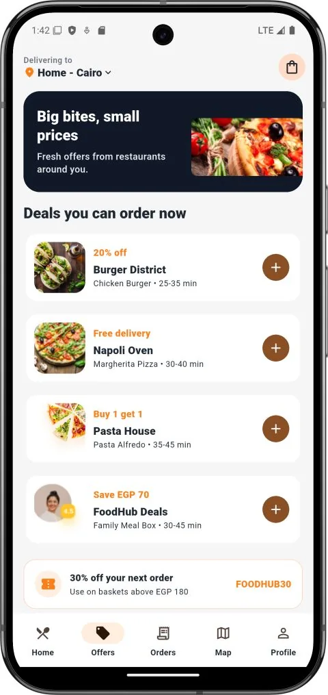
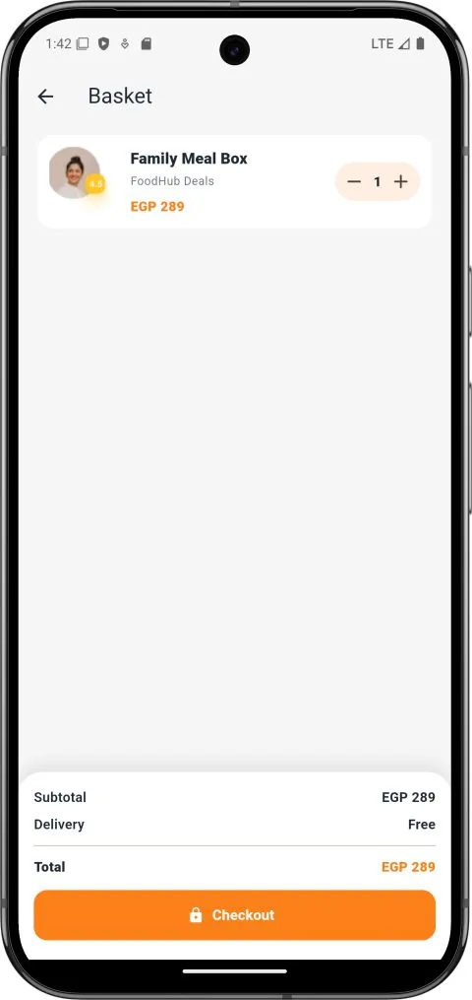
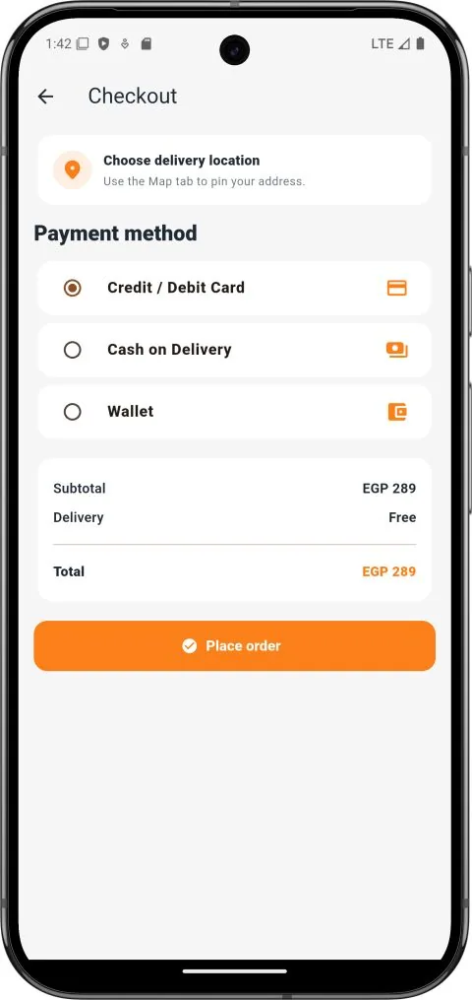
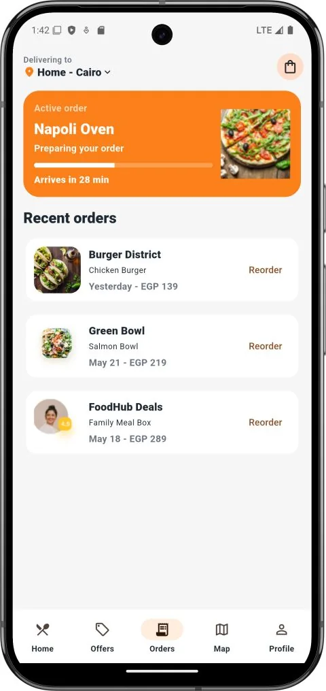

# Food Delivery App

A Flutter food-delivery interface built with feature-based clean architecture, GetX, a local food catalog, cart and checkout flows, and map-based delivery fees.

[](https://github.com/noaman03/food-delivery-app/releases/download/v1.0.0-demo.1/Food-Delivery-v1.0.0-demo.1.apk)

The APK is a debug-signed portfolio prerelease for side-loading and evaluation, not a production or Play Store build.

## Project Status

This is a portfolio demonstration. Its catalog is local, authentication screens are not connected to a user backend, and transaction processing is simulated. It should not be described as a live ordering or payment service.

## Screenshots

<p align="center">
  
  
  
  
</p>

## Features

- Splash and onboarding interfaces
- Login and signup presentation screens
- Dashboard navigation with home, offers, orders, and profile sections
- Local food catalog with category filtering
- Cart quantity updates and total calculation
- Checkout summary with card, cash, and wallet choices
- Simulated payment approval and generated transaction identifiers
- OpenStreetMap-based map with tap-to-select delivery location
- Haversine distance calculation
- Delivery fee formula of EGP 20 plus EGP 3.5 per kilometer, clamped to EGP 20-120

## Technology Stack

- Flutter and Dart
- Material 3
- GetX for routing, dependency bindings, controllers, and reactive state
- `flutter_map` and `latlong2`
- OpenStreetMap map tiles

## Architecture

```text
lib/
  app/
    bindings/                 GetX dependency registration
    routes/                   Named routes and pages
  core/
    theme/                    Shared Material theme
  features/
    onboarding/
    auth/
    dashboard/
    home/
      data/                   Local catalog data source and repository implementation
      domain/                 Food entity, repository contract, and use case
      presentation/           Home controller and page
    cart/                     Cart entity, use case, controller, and page
    map/                      Location entity, fee use case, controller, and map
    payment/                  Request entity, repository path, controller, and checkout
    offers/
    orders/
    profile/
```

The home, map, and payment features demonstrate data, domain, and presentation boundaries. This structure is used selectively; it does not imply a connected production backend.

## Prerequisites

- Flutter SDK compatible with `pubspec.yaml`
- Android Studio, Xcode, or another Flutter-capable IDE
- An emulator, simulator, browser, or physical device supported by the checked-in runners
- Internet access for OpenStreetMap tiles

## Installation and Running

```bash
git clone https://github.com/noaman03/food-delivery-app.git
cd food-delivery-app
flutter pub get
flutter run
```

## Validation

```bash
flutter analyze
flutter test
flutter build apk
flutter build web
```

Run only the build commands relevant to the platform configured on your development machine.

## Map Data and Attribution

The map page requests standard OpenStreetMap tiles. Any distribution or deployment must preserve the required attribution and comply with the [OpenStreetMap tile usage policy](https://operations.osmfoundation.org/policies/tiles/).

Map data: [OpenStreetMap contributors](https://www.openstreetmap.org/copyright).

## Known Limitations

- Food data is a static local list.
- Login and signup screens are not connected to an authentication service.
- Orders are not persisted to a server or local database.
- `PaymentRemoteDataSource` delays locally and returns a generated identifier; it does not contact a payment provider.
- The profile area contains presentation content rather than a connected account backend.
- No production address search, routing, driver tracking, or delivery API is implemented.

## Security

Do not treat the generated transaction identifiers as payment confirmation. A real deployment would require server-side order validation, a compliant payment provider, authenticated users, and protected backend endpoints.

## License

This repository is distributed under the terms in [`LICENSE`](LICENSE).

## Contact

[Ahmed Noaman](https://github.com/noaman03) | [LinkedIn](https://www.linkedin.com/in/ahmed-noaman-07ab162b4)
